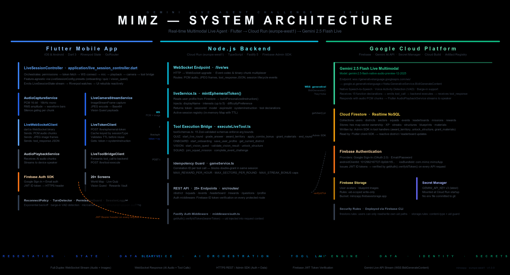

# Mimz

**Learn live. Build your district.**

Mimz is a mobile-first live voice-and-vision game where players grow a personal district on a stylized map by answering real-time spoken challenges, completing camera-based discovery quests, and collaborating in squads. Every interaction is voice-first and camera-capable — no typing, no multiple choice. Players speak, point, discover, and watch their world grow.

Built for the **Gemini Live Agent Challenge**. Powered by Gemini 2.5 Flash Native Audio API, Cloud Run, and Firestore.

---

## Why Mimz Matters

Learning apps are passive. Trivia games are shallow. Map games are solitary. Mimz combines all three into something new:

- **A live AI host** that speaks, listens, interrupts, and adapts — not a chatbot
- **Camera-powered quests** where pointing your phone at the real world earns rewards
- **Visible territory growth** tied to knowledge — every correct answer literally expands your map
- **Social competition** through squads and live events

The result is a product that could only exist with Gemini Live: real-time multimodal AI driving a game loop that feels alive.

---

## Core Features

| Feature | Modality | How Gemini Live Is Used |
|---------|----------|------------------------|
| **Live Quiz** | Voice-first | AI host reads questions aloud, scores spoken answers via `grade_answer` tool, applies streak bonuses |
| **Vision Quest** | Camera + AI | Player shows real-world objects, AI identifies them via `validate_vision_result`, awards blueprints |
| **Live Onboarding** | Conversational voice | AI collects interests and district name through natural speech, saves via `save_user_profile` |
| **District Growth** | Visual progression | AI triggers `award_territory`, `grant_materials`, `unlock_structure` — map updates in real-time |
| **Squad Missions** | Collaborative | Team challenges with coordinated objectives and shared progress |

---

## Why It Fits the Live Agents Category

Mimz is a **Live Agent** — not a chatbot wrapper. Here's why:

1. **Real-time bidirectional audio** — the AI speaks and listens simultaneously over WebSocket, not request/response
2. **Active vision** — the AI processes camera frames during Vision Quests, not just text descriptions
3. **Tool-call-driven game state** — Gemini executes 15 typed function calls that mutate authoritative backend state
4. **Interruption-aware** — players can barge in mid-sentence; the AI adapts and continues
5. **Persistent consequences** — every interaction changes the world (territory, structures, resources, leaderboards)

---

## Architecture



**Flow**: App gets ephemeral token from backend → opens WebSocket to Gemini → bidirectional audio + tool calls → tool results executed authoritatively on backend → state persisted to Firestore → UI updates reactively.

> 📎 **Devpost (required field answer)**: Uploaded in **Image Gallery** as `docs/assets/mimz_architecture.png` (16:9 system architecture diagram).

See [docs/ARCHITECTURE.md](docs/ARCHITECTURE.md) for full Mermaid diagrams and sequence flows.

---

## Tech Stack

| Layer | Technology | Purpose |
|-------|-----------|---------|
| Mobile | Flutter 3.x (Dart) | Cross-platform native UI |
| State | Riverpod | Reactive state management |
| Routing | go_router | Declarative navigation with shell |
| Backend | Fastify 5 (TypeScript) | REST API server |
| Database | Cloud Firestore | Document store with real-time sync |
| AI Engine | Gemini 2.5 Flash Native Audio | Real-time multimodal conversation |
| Auth | Firebase Authentication | Apple / Google / Email sign-in |
| Hosting | Google Cloud Run | Serverless container hosting |
| Maps | Google Maps Platform | Location-based district rendering |
| Validation | Zod | Runtime schema validation (backend) |
| Testing | Vitest | Backend unit tests (76 passing, 8 files) |

---

## Repo Structure

```
Mimz-Final/
├── app/                          # Flutter mobile app
│   └── lib/
│       ├── design_system/        # Tokens, typography, 5 reusable components
│       ├── features/             # 8 feature modules
│       │   ├── auth/             # Splash, Welcome, Sign Up
│       │   ├── onboarding/       # Permissions, Live Onboarding, District Naming
│       │   ├── world/            # World Home (map view)
│       │   ├── live/             # Play Hub, Live Quiz, Vision Quest + full live stack
│       │   ├── squads/           # Squad Hub
│       │   ├── events/           # Community Events
│       │   ├── profile/          # User Profile
│       │   └── rewards/          # Reward Vault
│       ├── routing/              # GoRouter + App Shell
│       └── services/             # API client, Auth, Audio, Location
├── backend/                      # Node.js + TypeScript backend
│   ├── src/
│   │   ├── config/               # Zod-validated environment config
│   │   ├── lib/                  # Firebase Admin, Firestore repositories (30+ functions)
│   │   ├── middleware/           # Firebase Auth token verification
│   │   ├── models/              # 20+ Zod domain schemas + Structure Catalog
│   │   ├── modules/live/        # Tool registry, 15 handlers, persona, token minting
│   │   ├── services/            # Game logic (scoring, rewards, territory, audit)
│   │   └── routes/              # 10 route files, 25+ endpoints
│   ├── test/                    # 8 test files, 76 tests
│   ├── Dockerfile               # Multi-stage Cloud Run build
│   └── .env.example             # All required environment variables
├── docs/                        # Comprehensive documentation
└── Screens/                     # Design reference assets
```

## Testing Infrastructure

The Mimz project features a rigorous dual-stack testing environment ensuring safe iteration and verified routing flows.

### Running Tests

We've provided centralized bash runbooks at the project root:

```bash
# Run entire test suite
./run_all_tests.sh

# Run only Flutter tests
./run_flutter_tests.sh

# Run only Backend tests 
./run_backend_tests.sh
```

For more detailed information on test overrides, CI readiness, and test suite structures, please refer to the `docs/TEST_RUNBOOK.md`.

---

## Quickstart

### Prerequisites

- Flutter SDK 3.x+ with Dart
- Node.js 20+
- A Firebase project with Authentication + Firestore enabled
- A Google Cloud project with Gemini API enabled
- (Optional) Google Maps API key for real map rendering

### Backend

```bash
cd backend
cp .env.example .env
# Edit .env — at minimum set GEMINI_API_KEY and GCP_PROJECT_ID

npm install
npm run dev
# Server starts on http://localhost:8080
# Verify: curl http://localhost:8080/healthz
```

### Flutter App

```bash
cd app
flutter pub get
flutter run \
  --dart-define=FIREBASE_ANDROID_API_KEY=YOUR_ANDROID_KEY \
  --dart-define=FIREBASE_IOS_API_KEY=YOUR_IOS_KEY
# For mock live sessions (no API key needed):
flutter run \
  --dart-define=USE_MOCK_LIVE=true \
  --dart-define=BACKEND_URL=http://localhost:8080 \
  --dart-define=FIREBASE_ANDROID_API_KEY=YOUR_ANDROID_KEY \
  --dart-define=FIREBASE_IOS_API_KEY=YOUR_IOS_KEY
```

---

## Reproducible Testing

**Judges:** Use the steps below to test this project. Steps 1–3 require no API keys or Google Cloud account; Step 4 needs the Flutter SDK; Step 5 is optional (Cloud Run).

Follow these steps to verify the project works:

### Step 1 — Backend Unit Tests (no API key needed)

```bash
cd backend
npm install
npm test
```

**Expected output:** You should see 8 test files and 76 tests passing, for example:
```
✓ test/structureCatalog.test.ts   (5 tests)
✓ test/domainModels.test.ts      (7 tests)
✓ test/modelConfig.test.ts       (4 tests)
✓ test/toolRegistry.test.ts     (9 tests)
✓ test/gameLogic.test.ts         (13 tests)
✓ test/validationService.test.ts (20 tests)
✓ test/idempotency.test.ts       (12 tests)
✓ test/routes.test.ts            (6 tests)

Test Files  8 passed (8)
     Tests  76 passed (76)
```

**What this proves:** Domain models validate correctly, all 15 tool schemas enforce bounds, scoring logic handles streaks/combos/difficulty, idempotent tool execution prevents double grants, the structure catalog is internally consistent, and health/readyz and route registration work.

### Step 2 — Backend API Smoke Test (no API key needed)

```bash
# Terminal 1: Start the backend in dev mode
cd backend
cp .env.example .env
npm run dev
# Output: 🚀 Mimz backend v1.0.0 listening on port 8080 [development]

# Terminal 2: Hit the health endpoints
curl -s http://localhost:8080/healthz | python3 -m json.tool
# Expected: { "status": "ok", "timestamp": "..." }

curl -s http://localhost:8080/readyz | python3 -m json.tool
# Expected: { "status": "ready", "timestamp": "..." }
```

**What this proves:** The Fastify server boots, config validates, routes register, and the health/readiness probes respond.

### Step 3 — Tool Execution Pipeline (no API key needed)

With the backend still running from Step 2:

```bash
# Bootstrap a test user (dev mode accepts requests without auth)
curl -s -X POST http://localhost:8080/auth/bootstrap | python3 -m json.tool
# Expected: { "user": { "id": "demo-user", "displayName": "Explorer", ... }, "district": { ... } }

# Execute a tool call (simulates what Gemini Live would trigger)
curl -s -X POST http://localhost:8080/live/tool-execute \
  -H "Content-Type: application/json" \
  -d '{"toolName":"grade_answer","args":{"answer":"Paris","isCorrect":true,"confidence":0.9},"sessionId":"test-session"}' \
  | python3 -m json.tool
# Expected: { "success": true, "data": { "pointsAwarded": ..., "newStreak": 1, ... } }

# Get live session config
curl -s http://localhost:8080/live/config | python3 -m json.tool
# Expected: { "modes": [...], "model": "gemini-2.5-flash-native-audio-preview-12-2025" }
```

**What this proves:** The full tool execution pipeline works end-to-end — Zod validates arguments, the handler runs scoring logic, and the response matches the expected shape. This is the same pipeline that Gemini Live tool calls flow through in production.

### Step 4 — Flutter App (requires Flutter SDK)

```bash
cd app
flutter pub get

# Option A: With mock live sessions (no API key needed)
flutter run --dart-define=USE_MOCK_LIVE=true --dart-define=BACKEND_URL=http://localhost:8080

# Option B: With real Gemini Live (requires GEMINI_API_KEY in backend .env)
flutter run --dart-define=BACKEND_URL=http://localhost:8080
```

**What this proves:** The 20+ screen Flutter app compiles, renders, and navigates through the full user flow (Splash → Auth → Onboarding → World Map → Quiz → Vision Quest → Rewards).

### Step 5 — Cloud Run Deployment (requires GCP account)

```bash
cd backend

# Build and deploy
gcloud builds submit --tag gcr.io/YOUR_PROJECT/mimz-backend
gcloud run deploy mimz-backend \
  --image gcr.io/YOUR_PROJECT/mimz-backend \
  --region us-central1 \
  --allow-unauthenticated \
  --set-env-vars="NODE_ENV=production,GCP_PROJECT_ID=YOUR_PROJECT,GEMINI_API_KEY=YOUR_KEY"

# Verify
curl https://mimz-backend-XXXXX.run.app/healthz
```

**What this proves:** The multi-stage Docker build works, the container runs on Cloud Run, and the production backend responds.

---

## Environment Variables

See [docs/ENVIRONMENT.md](docs/ENVIRONMENT.md) for full details.

**Backend** (`.env`):
| Variable | Required | Description |
|----------|----------|-------------|
| `GEMINI_API_KEY` | Yes | Google AI API key for Gemini |
| `GCP_PROJECT_ID` | Yes | Google Cloud project ID |
| `NODE_ENV` | No | `development` (default) or `production` |
| `PORT` | No | Server port (default: 8080) |

**Flutter** (dart-define):
| Variable | Required | Description |
|----------|----------|-------------|
| `BACKEND_URL` | No | Backend URL (default: `http://localhost:8080`) |
| `USE_MOCK_LIVE` | No | Enable mock adapter for development |

---

## Automated Cloud Deployment

Deployment is fully automated via bash scripts provided in the repository.

### One-Command Deploy

```bash
# Deploy everything with one command (Rules, Backend, FlutterFire)
./scripts/deploy_all.sh
```

This script ([`scripts/deploy_all.sh`](scripts/deploy_all.sh)) automates 3 steps:
1. **Applies Firebase Rules** (`firestore.rules` and `storage.rules`)
2. **Deploys Node.js Backend** to Cloud Run with all env vars + Secret Manager secrets
3. **Regenerates FlutterFire Config** to ensure the app has actual API keys

### CI/CD Pipeline

[`cloudbuild.yaml`](cloudbuild.yaml) defines a Cloud Build pipeline that runs on every push:

```yaml
# Automated pipeline steps:
1. npm ci && npm test          # Run 76 unit tests — fail fast
2. docker build                # Multi-stage production image
3. docker push                 # Tag with git SHA + latest
4. gcloud run deploy           # Deploy to Cloud Run
5. curl /healthz               # Verify — fail build if unhealthy
```

### Setup Cloud Build Trigger

```bash
# Connect repo and create trigger (one-time setup)
gcloud builds triggers create github \
  --repo-name=Mimz-Final \
  --branch-pattern=main \
  --build-config=cloudbuild.yaml \
  --project=YOUR_PROJECT_ID
```

> 📎 **Judges**: See [`scripts/deploy_all.sh`](scripts/deploy_all.sh) and [`cloudbuild.yaml`](cloudbuild.yaml) for the full automation code.

See [docs/RUNBOOK.md](docs/RUNBOOK.md) for manual instructions and [docs/DEPLOYMENT_SUMMARY.md](docs/DEPLOYMENT_SUMMARY.md) for full deployment output.

---

## Proof of Google Cloud Deployment

**For judges:** One code file is enough to prove GCP usage.

### Primary proof (single link)

**[scripts/deploy_backend.sh](scripts/deploy_backend.sh)** — deploys the backend to **Cloud Run** (`gcloud run deploy`), sets Firestore/Firebase env vars, and wires **Gemini API** via Secret Manager (`GEMINI_API_KEY=GEMINI_API_KEY:latest`). Use this repo link in your submission (e.g. `https://github.com/OWNER/Mimz-Final/blob/main/scripts/deploy_backend.sh`).

### Optional: screen recording

A short screen recording of the app on GCP (Cloud Run console, Firestore, logs) also qualifies. What to capture and how to redact: [docs/CLOUD_PROOF.md](docs/CLOUD_PROOF.md).

### Optional: more code links

| GCP service | File |
|-------------|------|
| Cloud Run CI/CD | [cloudbuild.yaml](cloudbuild.yaml) |
| Firestore + Firebase Auth | [backend/src/lib/firebase.ts](backend/src/lib/firebase.ts), [backend/src/lib/db.ts](backend/src/lib/db.ts) |
| Gemini Live (token, tools) | [backend/src/modules/live/liveService.ts](backend/src/modules/live/liveService.ts), [backend/src/routes/live.ts](backend/src/routes/live.ts) |
| Auth middleware | [backend/src/middleware/auth.ts](backend/src/middleware/auth.ts) |

---

## Demo Walkthrough

| Time | What Happens | What the Judge Sees |
|------|-------------|-------------------|
| 0:00 | Problem framing | Why learning apps are broken |
| 0:20 | Launch Mimz | Splash → animated map background |
| 0:40 | Sign in + permissions | One-tap auth, privacy-first permission flow |
| 1:00 | **Live Onboarding** | AI greets by voice, collects interests conversationally |
| 1:40 | District creation | Name your territory, see it on the map |
| 2:00 | **Live Quiz** | AI reads questions, player speaks answers, score updates live |
| 2:50 | **Interruption demo** | Player barges in mid-question — AI adapts |
| 3:10 | **Vision Quest** | Camera opens, AI identifies objects, blueprint awarded |
| 3:40 | District growth | Territory expands on map, new structure unlocked |
| 4:00 | Squad + Events | Social features, leaderboard |
| 4:20 | Backend proof | Cloud Run logs, Firestore console |
| 4:30 | Closing | "Mimz makes learning live." |

Full script: [docs/DEMO_SCRIPT.md](docs/DEMO_SCRIPT.md)

---

## Screenshots

> **TODO**: Capture and add the following screenshots to `docs/assets/`:
> 1. World Home map view with district
> 2. Live Quiz with waveform animation
> 3. Vision Quest camera interface
> 4. Reward Vault with blueprints
> 5. Squad Hub

See [docs/assets/demo-checklist.md](docs/assets/demo-checklist.md) for the full capture list.

---

## Known Limitations

This is a hackathon build. The following is intentionally scoped:

- **Auth Providers**: Google Sign-In and Email auth are fully implemented in the app, but explicitly enabling them in the Firebase Console is a required manual step.
- **Audio capture/playback** services have interfaces implemented; platform-specific package code needs uncommenting after iOS/Android permission setup
- **Google Maps** renders as a stylized grid painter in demo; real map rendering requires API key configuration
- **Real-time multiplayer** (squad missions, live events) is single-player demo
- **No push notifications**, AR view, or offline mode

See [docs/KNOWN_LIMITATIONS.md](docs/KNOWN_LIMITATIONS.md) for the full honest assessment.

---

## Roadmap

| Phase | Features |
|-------|----------|
| **Post-hackathon** | Real Google Maps rendering, persistent leaderboards, seasonal events |
| **Beta** | Multi-player live quiz rooms, AR structure preview, FCM notifications |
| **Launch** | App Store / Play Store release, accessibility audit, i18n |

See [docs/ROADMAP.md](docs/ROADMAP.md) for details.

---

## Documentation

| Document | Purpose |
|----------|---------|
| [ARCHITECTURE.md](docs/ARCHITECTURE.md) | System design, diagrams, data flows |
| [CLOUD_PROOF.md](docs/CLOUD_PROOF.md) | How to prove GCP usage (screen recording, console, logs) |
| [HACKATHON_SUBMISSION.md](docs/HACKATHON_SUBMISSION.md) | Devpost-ready submission content |
| [DEMO_SCRIPT.md](docs/DEMO_SCRIPT.md) | 4-minute demo walkthrough with failure recovery |
| [SETUP.md](docs/SETUP.md) | Full developer setup guide |
| [ENVIRONMENT.md](docs/ENVIRONMENT.md) | All environment variables |
| [API_REFERENCE.md](docs/API_REFERENCE.md) | Complete 25-endpoint API docs |
| [FIRESTORE_SCHEMA.md](docs/FIRESTORE_SCHEMA.md) | All 10 Firestore collections |
| [LIVE_BACKEND_FLOW.md](docs/LIVE_BACKEND_FLOW.md) | Token + tool execution flows |
| [LIVE_MESSAGE_FLOW.md](docs/LIVE_MESSAGE_FLOW.md) | WebSocket message formats |
| [SECURITY_MODEL.md](docs/SECURITY_MODEL.md) | Auth, privacy, anti-abuse |
| [KNOWN_LIMITATIONS.md](docs/KNOWN_LIMITATIONS.md) | Honest scope assessment |
| [JUDGING_NOTES.md](docs/JUDGING_NOTES.md) | What judges should notice |
| [SCREEN_MAPPING.md](docs/SCREEN_MAPPING.md) | Design-to-code screen mapping |

---

## Challenge Alignment

| Criterion | How Mimz Delivers |
|-----------|------------------|
| **Live Agent** | Gemini Live WebSocket — real-time bidirectional voice + vision |
| **Beyond Text** | Voice-first gameplay, camera quests, map visualization |
| **Google Cloud** | Cloud Run (backend), Firestore (persistence), Firebase Auth (identity) |
| **Originality** | No existing product combines live AI hosting + territory building + camera quests |
| **Technical Depth** | 15 validated tool calls, backend-authoritative state, anti-abuse protections |
| **Polish** | 20+ screens, editorial design system, production-grade error handling |

---

MIT © 2025 Mimz
