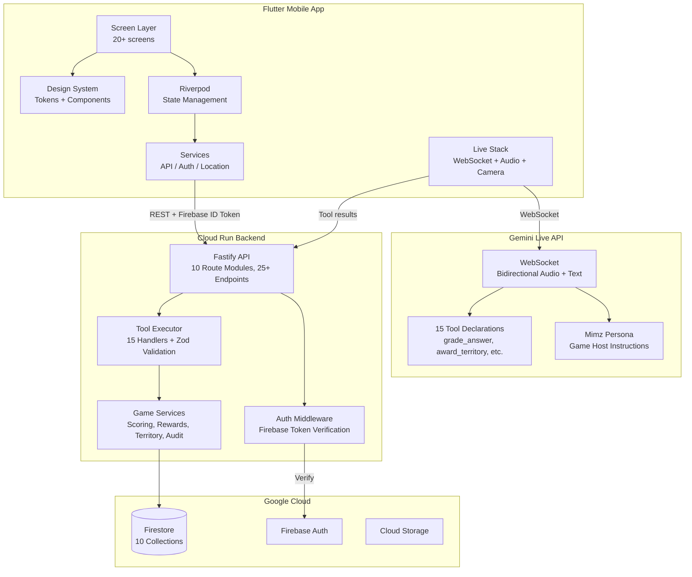
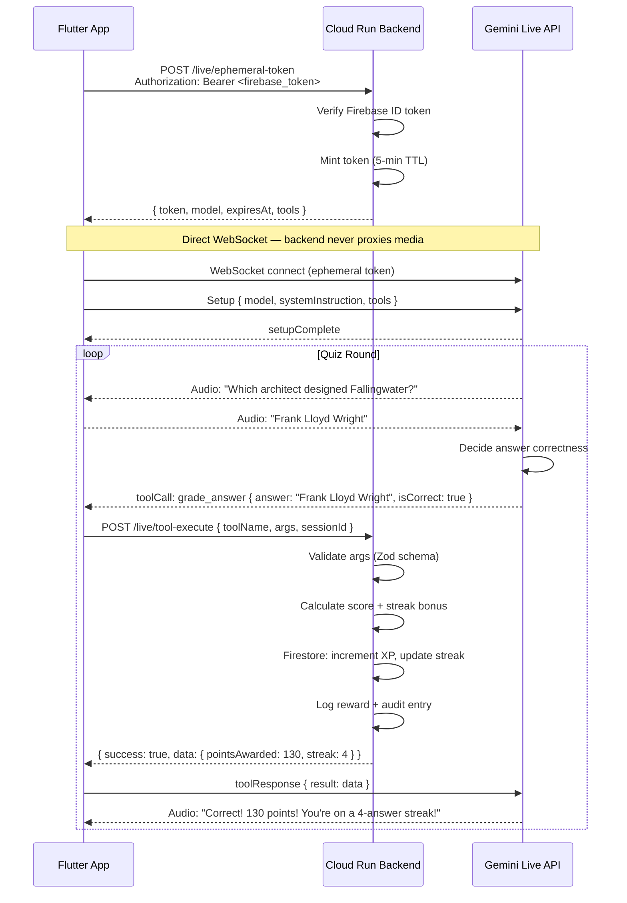
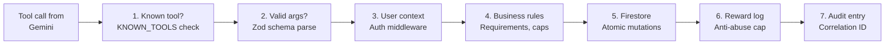
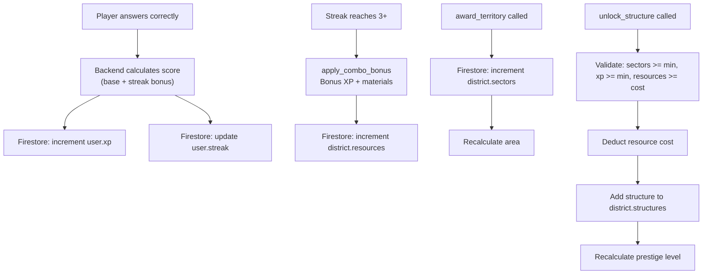
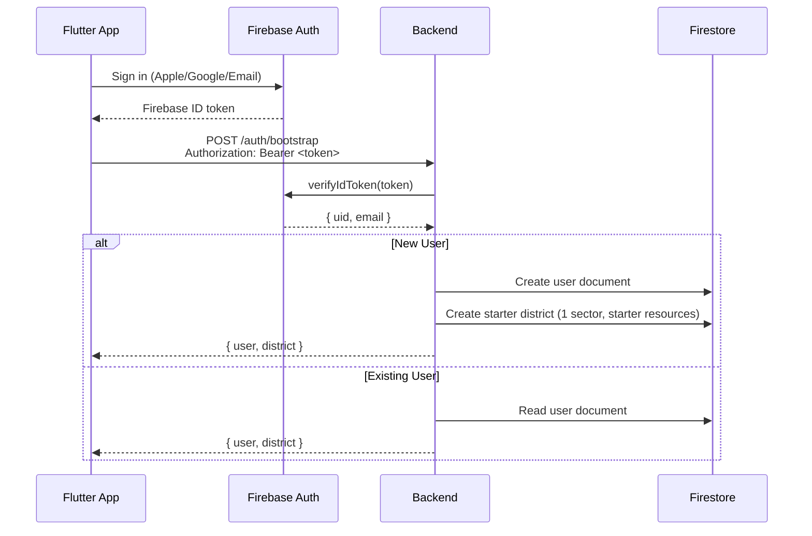

# Architecture — Mimz

## System Overview

Mimz uses a split architecture where the Flutter app handles media and UI, Gemini Live handles real-time conversation, and the Cloud Run backend remains the single authority for game state.

## Why This Split

| Responsibility | Who Owns It | Why |
|---------------|------------|-----|
| Audio/video capture | Flutter app | Platform APIs require native access |
| Conversation persona | Gemini Live | Real-time voice requires direct WebSocket |
| Game state mutations | Backend only | Prevents cheating; model output can hallucinate values |
| Score calculation | Backend only | Streak bonuses, combo multipliers enforced server-side |
| Resource deduction | Backend only | Structure costs validated against actual inventory |
| UI rendering | Flutter app | 60fps native rendering |

Key insight: **Gemini proposes, backend disposes**. The AI suggests game actions via tool calls, but the backend validates and executes them authoritatively.

---

## Live Session Flow

## Tool Execution Flow

Every tool call follows a 7-step validation pipeline:

**15 registered tools:**

| Tool | Category | Mutates State |
|------|----------|:---:|
| `start_onboarding` | Onboarding | ✅ |
| `save_user_profile` | Onboarding | ✅ |
| `get_current_district` | District | ❌ |
| `start_live_round` | Quiz | ✅ |
| `grade_answer` | Quiz | ✅ |
| `award_territory` | Quiz | ✅ |
| `apply_combo_bonus` | Quiz | ✅ |
| `grant_materials` | Quiz | ✅ |
| `end_round` | Quiz | ✅ |
| `start_vision_quest` | Vision | ❌ |
| `validate_vision_result` | Vision | ✅ |
| `unlock_structure` | District | ✅ |
| `join_squad_mission` | Social | ❌ |
| `contribute_squad_progress` | Social | ✅ |
| `get_event_state` | Social | ❌ |

---

## District State Persistence

## Auth / Bootstrap Flow

---

## Firestore Collections

| Collection | Key Fields | Role |
|-----------|-----------|------|
| `users/{uid}` | xp, streak, sectors, interests | Player identity and progression |
| `districts/{id}` | sectors, structures, resources | Territory and inventory |
| `liveSessions/{id}` | topic, score, questions | Round tracking |
| `rewards/{id}` | type, amount, source | Reward audit trail |
| `squads/{id}` | name, joinCode, members | Team management |
| `events/{id}` | title, status, participants | Community challenges |
| `leaderboards/{scope}/entries/{uid}` | score, rank | Rankings |
| `auditLogs/{id}` | action, toolName, correlationId | Security audit |
| `notifications/{id}` | type, title, read | User notifications |

See [FIRESTORE_SCHEMA.md](FIRESTORE_SCHEMA.md) for full document shapes and indexes.

---

## Security and Trust Boundaries

1. **Transport**: All Cloud Run traffic is HTTPS with managed TLS
2. **Identity**: Firebase Auth tokens verified on every request
3. **Session**: Ephemeral tokens (5-min TTL) for Gemini Live — no long-lived API keys on client
4. **Authorization**: Backend extracts `userId` from verified token — no client-supplied user IDs trusted
5. **Validation**: All tool call args validated by Zod schemas with bounded ranges
6. **Anti-abuse**: Reward cap (5,000 XP/hour), territory cap (3 sectors/round), streak cap (10x)
7. **Privacy**: Public district views return only coarse data — never owner ID or cell coordinates
8. **Audit**: Every state mutation logged with correlation ID

See [SECURITY_MODEL.md](SECURITY_MODEL.md) for the full model.

---

## Failure and Retry Handling

| Failure | Client Behavior | Backend Behavior |
|---------|----------------|-----------------|
| WebSocket disconnect | Exponential backoff (max 5 retries) + token refresh | N/A (stateless) |
| Tool call timeout | Retry once, then show error pill | Return timeout error |
| Invalid tool args | Display error, continue session | Reject with Zod error message |
| Firebase token expired | Transparent re-auth via refresh token | 401 → client re-authenticates |
| Reward cap hit | Show "slow down" message | Return cap error with details |
| Firestore error | N/A (handled server-side) | Log error, return safe error response |

---

## Scale Notes

- Cloud Run auto-scales from 0 to 10 instances (configurable)
- Firestore handles up to 10,000 writes/sec per collection
- Ephemeral tokens prevent token replay attacks
- Rate limiting: 100 requests/minute per IP
- Backend is stateless — any instance handles any request
- Body limit: 1MB per request
