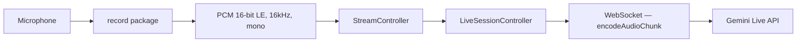
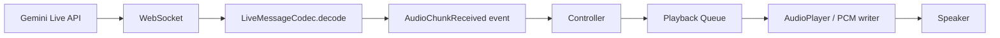
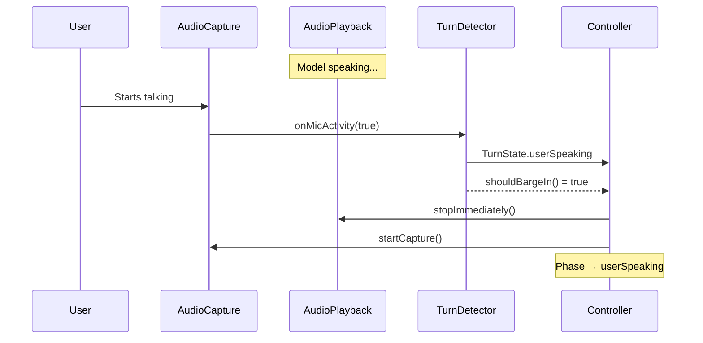

# Audio Pipeline

How audio flows between the user's microphone, Flutter, and Gemini Live API.

## Capture Pipeline

### Configuration
- Format: PCM 16-bit little-endian
- Sample rate: 16,000 Hz
- Channels: 1 (mono)
- Chunk size: ~640 bytes (20ms at 16kHz × 2 bytes)

### Lifecycle
1. Permission checked by `LivePermissionGuard`
2. `startCapture()` opens mic stream
3. Each chunk flows through `audioStream` to the controller
4. Controller calls `_ws.sendAudio(chunk)` which base64-encodes via codec
5. `pauseCapture()` / `resumeCapture()` for barge-in
6. `stopCapture()` + disposal on session end

## Playback Pipeline

### Queue Behavior
- Chunks are queued and played sequentially
- No overlap — next chunk plays only after current finishes
- Duration estimated from PCM size: `bytes / 48` ms (24kHz × 2 bytes)
- `stopImmediately()` clears queue + stops current playback (barge-in)
- `flushQueue()` discards remaining without stopping current
- State exposed via `playbackStateStream`

## Barge-In (Interruption)

## Known Limitations
- Actual `record` package integration requires platform setup (iOS Info.plist, Android manifest)
- PCM playback via `just_audio` needs temporary file writes
- No echo cancellation — relies on device AEC
