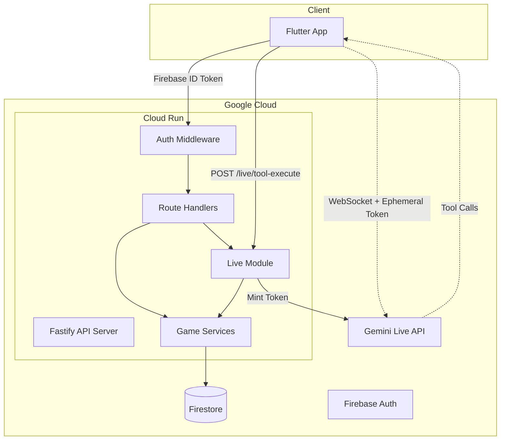

# Backend Architecture

## System Overview



## Core Principles

1. **Backend is authoritative** — all game state mutations happen server-side
2. **No long-lived API keys on client** — ephemeral tokens only
3. **Model output never mutates state directly** — tool calls are validated and executed by backend
4. **Privacy by default** — public endpoints return coarse data only

## Module Responsibilities

| Module | Files | Purpose |
|--------|-------|---------|
| Config | `config/index.ts` | Zod-validated environment variables with runtime checks |
| Firebase | `lib/firebase.ts` | Admin SDK singleton, Firestore + Auth initialization |
| Database | `lib/db.ts` | 30+ typed Firestore repository functions |
| Auth | `middleware/auth.ts` | Firebase ID token verification, request decoration |
| Models | `models/types.ts` | 20+ Zod schemas for all domain types |
| Game Logic | `services/gameService.ts` | Auth, district, rewards, scoring, audit |
| Live Module | `modules/live/` | Tool registry, execution, schemas, persona, token minting |
| Routes | `routes/` | 10 route files, 25+ endpoints |

## Data Flow

### 1. User Bootstrap
```
Client → POST /auth/bootstrap → Auth Middleware → bootstrapUser() 
→ Firestore: create user + district → return { user, district }
```

### 2. Live Quiz Round
```
Client → POST /live/ephemeral-token → mintEphemeralToken()
Client → WebSocket to Gemini Live API (direct)
Gemini → tool_call: grade_answer
Client → POST /live/tool-execute { toolName, args, sessionId }
Backend → validate args (Zod) → execute handler → Firestore mutations → audit log
Backend → return { success, data } → Client → send tool response to Gemini
```

### 3. Structure Unlock
```
Client → POST /district/unlock-structure { structureId }
Backend → validate catalog entry → check requirements (sectors, XP) 
→ check resources → deduct cost → add structure → audit → return
```

## Firestore Collections

| Collection | Document Shape | Access Pattern |
|-----------|----------------|----------------|
| `users/{uid}` | User profile, XP, streak | Read on every request |
| `districts/{id}` | Sectors, structures, resources | Read on game state queries |
| `liveSessions/{id}` | Round data, score tracking | Write during quiz rounds |
| `squads/{id}` | Name, join code, member count | Read/write on squad ops |
| `events/{id}` | Title, status, participant count | Read on event listings |
| `leaderboards/{scope}/entries/{uid}` | Score, rank, name | Read on leaderboard queries |
| `rewards/{id}` | Type, amount, source, timestamp | Write on every reward grant |
| `auditLogs/{id}` | Action, tool, session, detail | Write on mutations |
| `notifications/{id}` | Type, title, body, read flag | Read on notification feed |

## Anti-Abuse Protections

- Firebase ID token verification (production mode)
- Rate limiting via `@fastify/rate-limit`
- Reward cap per hour (`maxRewardPerHour: 5000`)
- Max sectors per round (`maxSectorsPerRound: 3`)
- Streak bonus cap (`maxStreakBonus: 10`)
- Tool argument bounds validation (Zod schemas)
- Structure unlock validates requirements + resources
- Audit log for all mutating operations
- Error responses sanitized in production
