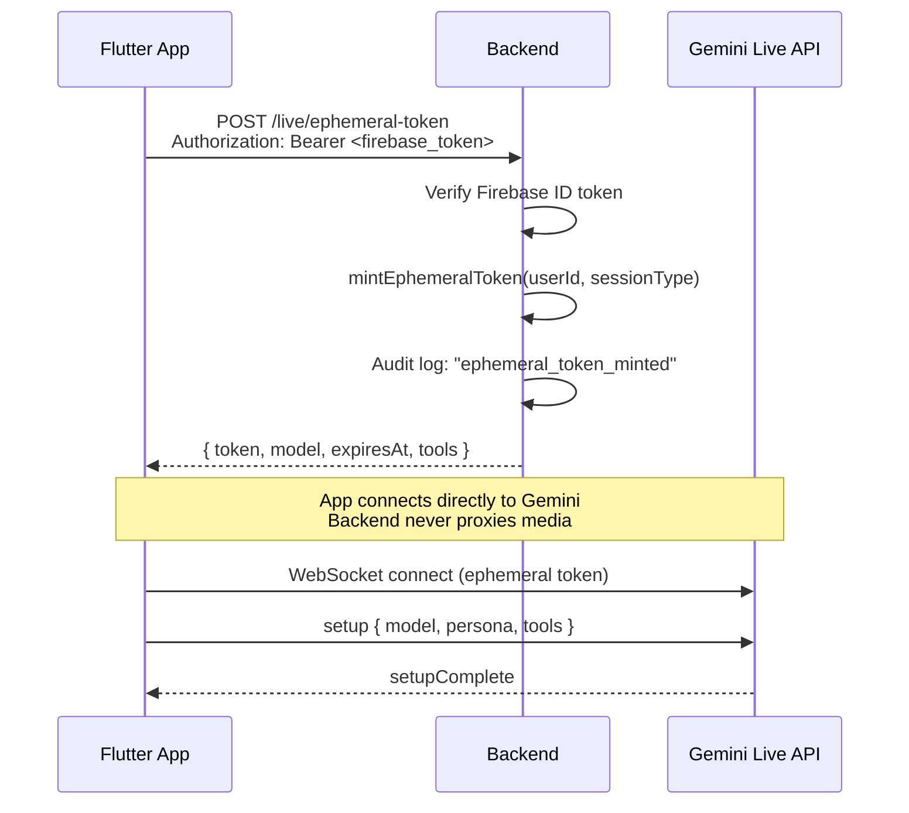
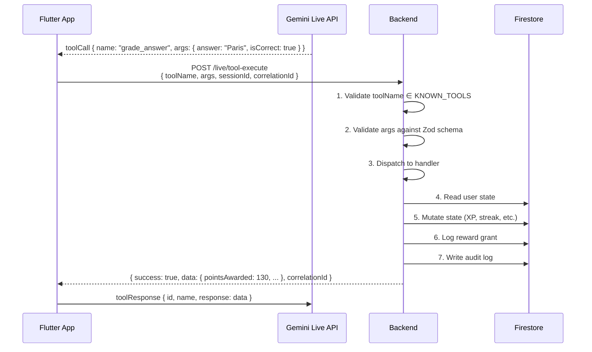

# Live Backend Flow

How the backend supports Gemini Live sessions for Mimz.

## Ephemeral Token Lifecycle



### Token Security
- Tokens are short-lived (5 minutes default, configurable via `EPHEMERAL_TOKEN_TTL_MS`)
- Backend never returns long-lived `GEMINI_API_KEY` in production
- Token is scoped to the user's session type
- Not persisted — exists only in transit

## Tool Execution Lifecycle



### Why Backend Remains Authoritative

1. **Model can hallucinate tool arguments** — backend validates all inputs via Zod schemas with bounds (e.g., `sectors: 1-5`, `materials: 0-500`)
2. **Reward caps** — backend tracks total rewards per hour and rejects if cap exceeded
3. **State consistency** — only backend reads/writes Firestore, preventing race conditions
4. **Anti-abuse** — impossible growth validation, duplicate quest suppression
5. **Audit trail** — every mutation is logged with userId, tool name, session ID, correlation ID

## Failure Handling

| Failure | Behavior |
|---------|----------|
| Invalid tool name | Return `{ success: false, error: "Unknown tool" }` immediately |
| Invalid args (Zod fail) | Return `{ success: false, error: "Invalid args..." }` |
| Firestore error | Catch, log, return error — do not crash |
| Reward cap exceeded | Return error with cap information |
| Structure requirements unmet | Return error with requirement details |
| Token expired (client-side) | Client refetches via `/live/ephemeral-token` |

## Tool Registry

All 15 tools are validated through the same pipeline:

```
toolName → KNOWN_TOOLS check → TOOL_SCHEMAS[toolName].safeParse(args) → handlers[toolName](args, ctx) → response
```

| Tool | Mutates | Audit |
|------|---------|-------|
| `start_onboarding` | ✅ User + District | ✅ |
| `save_user_profile` | ✅ User | ✅ |
| `get_current_district` | ❌ Read only | ❌ |
| `start_live_round` | ✅ LiveSession | ✅ |
| `grade_answer` | ✅ User XP/streak + Round | ✅ |
| `award_territory` | ✅ District sectors | ✅ |
| `apply_combo_bonus` | ✅ User XP + Resources | ✅ |
| `grant_materials` | ✅ District resources | ✅ |
| `end_round` | ✅ Round status + Leaderboard | ✅ |
| `start_vision_quest` | ❌ Read only | ✅ |
| `validate_vision_result` | ✅ User XP | ✅ |
| `unlock_structure` | ✅ District structures/resources | ✅ |
| `join_squad_mission` | ❌ Read only | ❌ |
| `contribute_squad_progress` | ✅ Squad mission | ❌ |
| `get_event_state` | ❌ Read only | ❌ |
