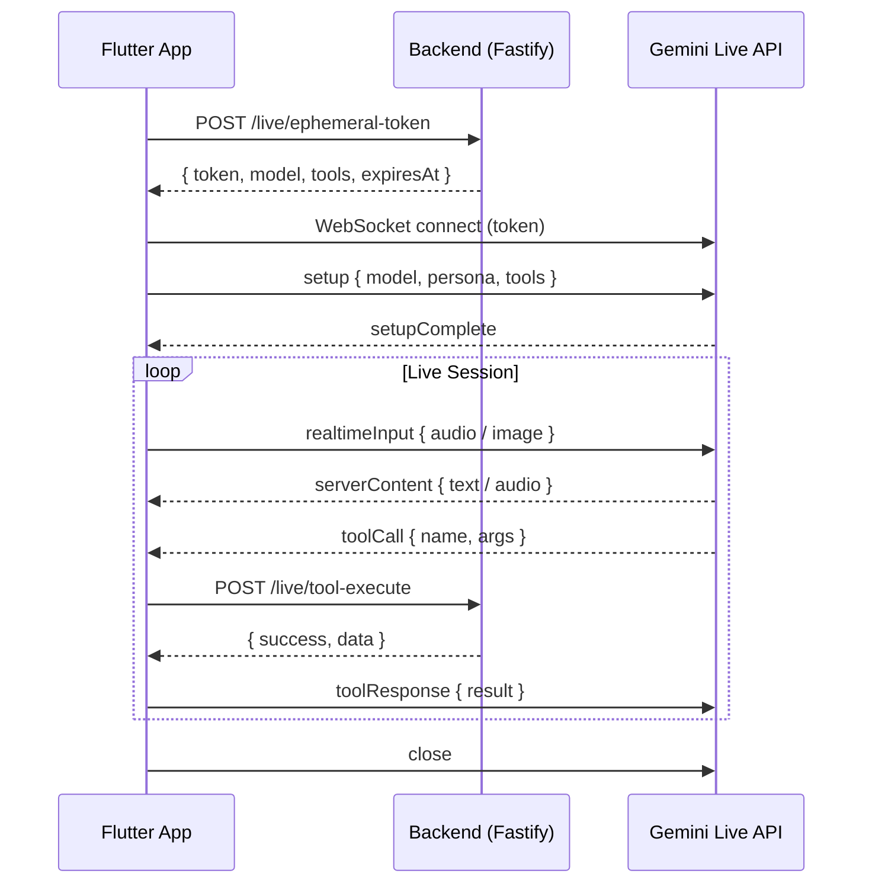

# Live Integration Guide

How the Mimz Flutter app connects to Gemini Live API and bridges tool calls through the backend.

## Architecture Overview

## Module Map

| Layer | File | Purpose |
|-------|------|---------|
| Domain | `live_connection_phase.dart` | 11 lifecycle states |
| Domain | `live_event.dart` | 18 typed sealed events |
| Domain | `live_session_state.dart` | Immutable state snapshot |
| Domain | `live_session_config.dart` | Mode presets (onboarding/quiz/vision) |
| Domain | `live_tool_registry.dart` | 15 tool constants |
| Data | `live_message_codec.dart` | Encode/decode Gemini protocol |
| Data | `live_websocket_client.dart` | dart:io WebSocket |
| Data | `live_token_client.dart` | Token fetch + cache |
| Data | `live_tool_bridge_client.dart` | Tool call → backend |
| Data | `live_audio_capture_service.dart` | Mic → PCM stream |
| Data | `live_audio_playback_service.dart` | PCM → speaker queue |
| Data | `live_camera_stream_service.dart` | Camera → JPEG frames |
| Data | `live_backend_dtos.dart` | 8 typed request/response models |
| Data | `live_mock_adapter.dart` | Dev-mode event replay |
| App | `live_session_controller.dart` | Orchestrator |
| App | `live_turn_detector.dart` | Speaking/listening transitions |
| App | `live_reconnect_policy.dart` | Backoff + retry |
| App | `live_error_mapper.dart` | Error → UX |
| App | `live_permission_guard.dart` | Permission checks |
| App | `live_session_logger.dart` | Debug timeline |

## Ephemeral Token Flow

1. Controller calls `LiveTokenClient.fetchToken(sessionType)`
2. Client checks cache — returns cached if TTL > 1 minute remaining
3. If not cached, POSTs `/live/ephemeral-token` with session type
4. Backend mints a 5-minute token and returns tools for that session type
5. Token is never persisted to disk — only held in memory
6. On reconnect, token is invalidated and re-fetched

## Feature Flags

- `USE_MOCK_LIVE=true` — run with mock adapter (no API key needed)
- Pass via `--dart-define=USE_MOCK_LIVE=true`

## Required Environment Variables

| Variable | Description |
|----------|-------------|
| `BACKEND_URL` | Backend base URL (default: `http://localhost:8080`) |
| `USE_MOCK_LIVE` | Enable mock adapter (default: `false`) |
