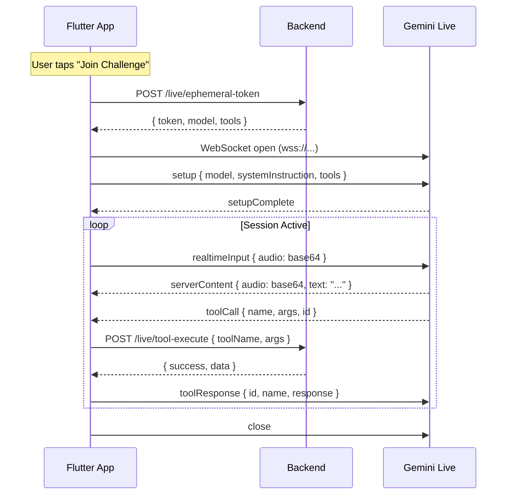

# Live Message Flow — Mimz

How messages travel between the Flutter app, Gemini Live API, and the backend during a live session.

---

## Connection Lifecycle



---

## Outgoing Messages (App → Gemini)

### 1. Setup
```json
{
  "setup": {
    "model": "models/gemini-2.0-flash-live-001",
    "generationConfig": {
      "responseModalities": ["AUDIO"],
      "speechConfig": { "voiceConfig": { "prebuiltVoiceConfig": { "voiceName": "Puck" } } }
    },
    "systemInstruction": { "parts": [{ "text": "You are Mimz..." }] },
    "tools": [{ "functionDeclarations": [...] }]
  }
}
```

### 2. Audio Input
```json
{
  "realtimeInput": {
    "mediaChunks": [{
      "mimeType": "audio/pcm;rate=16000",
      "data": "<base64 PCM audio>"
    }]
  }
}
```

### 3. Text Input (fallback)
```json
{
  "clientContent": {
    "turns": [{ "role": "user", "parts": [{ "text": "..." }] }],
    "turnComplete": true
  }
}
```

### 4. Tool Response
```json
{
  "toolResponse": {
    "functionResponses": [{
      "id": "call_abc123",
      "name": "grade_answer",
      "response": { "pointsAwarded": 130, "streak": 4 }
    }]
  }
}
```

### 5. Camera Frame
```json
{
  "realtimeInput": {
    "mediaChunks": [{
      "mimeType": "image/jpeg",
      "data": "<base64 JPEG frame>"
    }]
  }
}
```

---

## Incoming Messages (Gemini → App)

### 1. Setup Complete
```json
{ "setupComplete": {} }
```

### 2. Server Audio
```json
{
  "serverContent": {
    "modelTurn": {
      "parts": [{ "inlineData": { "mimeType": "audio/pcm;rate=24000", "data": "<base64>" } }]
    }
  }
}
```

### 3. Server Text (with audio)
```json
{
  "serverContent": {
    "modelTurn": {
      "parts": [{ "text": "Which architect designed Fallingwater?" }]
    }
  }
}
```

### 4. Tool Call
```json
{
  "toolCall": {
    "functionCalls": [{
      "id": "call_abc123",
      "name": "grade_answer",
      "args": { "answer": "Frank Lloyd Wright", "isCorrect": true, "confidence": 0.95 }
    }]
  }
}
```

### 5. Turn Complete
```json
{
  "serverContent": { "turnComplete": true }
}
```

### 6. Interrupted
```json
{
  "serverContent": { "interrupted": true }
}
```

---

## Tool Call Routing

When the app receives a `toolCall` message:

1. Extract `functionCalls[0]` → `{ id, name, args }`
2. POST to backend: `{ toolName: name, args, sessionId, correlationId: id }`
3. Backend validates and executes
4. Backend returns `{ success, data }`
5. App sends `toolResponse` to Gemini with the `id` and `data`
6. Gemini continues the conversation using the tool result

The app **never** interprets tool results directly. All state changes come from backend-confirmed responses.
