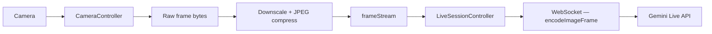
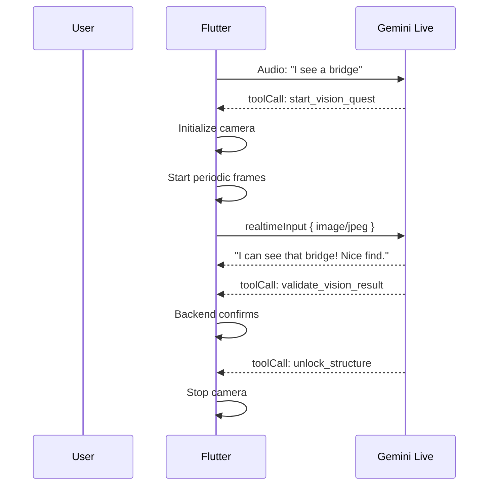

# Vision Pipeline

How camera frames flow from the device camera to Gemini Live API for vision quests.

## Architecture

## Two Operating Modes

### One-Shot Mode
- Call `captureOneShot()` for a single frame
- Controller calls it via `attachCameraFrame()`
- User taps camera button → frame sent → Gemini analyzes

### Periodic Mode
- `startPeriodicCapture()` sends frames every N seconds (default: 2s)
- For active vision quest windows
- Controlled interval prevents flooding
- `stopPeriodicCapture()` stops the timer

## Frame Processing

| Parameter | Default | Purpose |
|-----------|---------|---------|
| `jpegQuality` | 70 | Compression quality (0-100) |
| `maxDimension` | 640px | Downscale limit (preserves aspect ratio) |
| `frameInterval` | 2s | Time between periodic captures |

## Session Flow

## Known Limitations
- `camera` package requires platform setup (iOS NSCameraUsageDescription, Android)
- Frame processing (downscale) requires `image` package
- No video streaming — still frames only
- Camera session must be disposed on route pop
