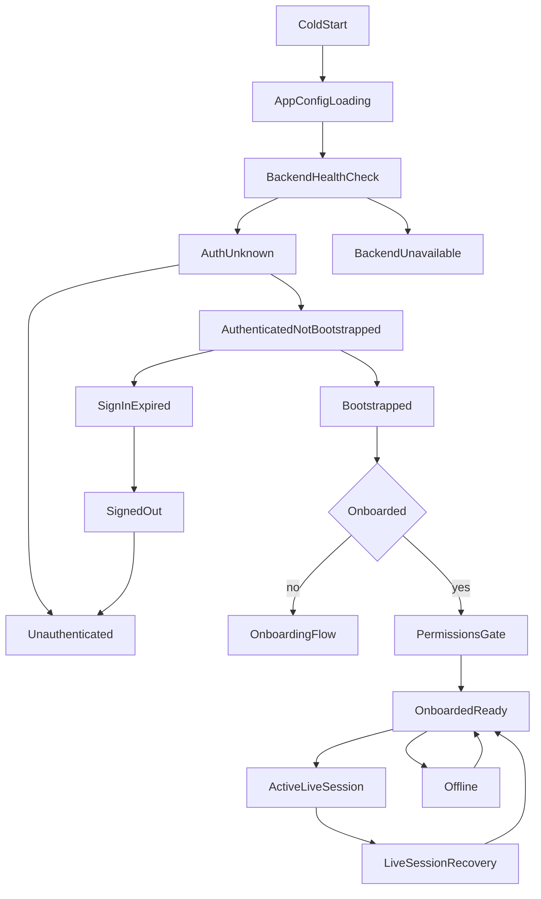

# Mimz App State Machine

Last updated: 2026-03-18

## Scope

Global runtime state machine for launch, authentication, onboarding, gameplay, recovery, and sign-out.

## High-Level Flow

## State Definitions

| State | Entry Conditions | Required Data | Target UI | Allowed Next States | Failure/Retry |
|---|---|---|---|---|---|
| `ColdStart` | Process launched | none | Native splash | `AppConfigLoading` | N/A |
| `AppConfigLoading` | Flutter app boot | env/config/model registry | Splash | `BackendHealthCheck`, `AuthUnknown` | If config invalid, show fatal config error screen with diagnostics |
| `BackendHealthCheck` | Startup or foreground resume | backend URL + timeout policy | Splash/inline loader | `AuthUnknown`, `BackendUnavailable` | Retry with backoff; allow degraded non-live read paths |
| `AuthUnknown` | Firebase stream not settled | auth status stream | Splash | `Unauthenticated`, `AuthenticatedNotBootstrapped` | timeout -> treat as unauth + show recoverable banner |
| `Unauthenticated` | no valid Firebase session | none | Welcome/Auth | `AuthenticatedNotBootstrapped` | auth errors show inline and retry |
| `AuthenticatedNotBootstrapped` | Firebase auth success | valid ID token | Bootstrap loader | `Bootstrapped`, `SignInExpired`, `BackendUnavailable` | 401 -> sign-out recovery; transient -> retry |
| `Bootstrapped` | `/auth/bootstrap` success | user profile + district seed | Route gate resolver | `OnboardingFlow`, `PermissionsGate`, `OnboardedReady` | if district missing -> bootstrap replay |
| `OnboardingFlow` | profile incomplete | onboarding draft state | onboarding screens | `PermissionsGate`, `OnboardedReady` | each step retryable and resumable |
| `PermissionsGate` | onboarding done but required permissions missing | permission statuses | permission explainer screens | `OnboardedReady` | deny/perma-deny -> guided settings actions |
| `OnboardedReady` | auth + bootstrap + onboarding complete | user + district + route shell | World shell/tabs | `ActiveLiveSession`, `Offline`, `BackendUnavailable`, `SignedOut` | retry actions always visible |
| `ActiveLiveSession` | player starts live mode | mic (and camera for vision) + ephemeral token/session | live quiz/vision | `OnboardedReady`, `LiveSessionRecovery` | connect/reconnect with bounded attempts |
| `LiveSessionRecovery` | live stream/tool failure | session metadata + last action | live recovery panel | `ActiveLiveSession`, `OnboardedReady` | retry, fallback mode, or exit |
| `Offline` | network lost | cached last-known state | offline banner + limited UI | `OnboardedReady`, `BackendUnavailable` | auto resume when online |
| `BackendUnavailable` | backend non-retryable outage | request diagnostics | global error sheet | previous stable state, `SignedOut` | exponential retry + support CTA |
| `SignInExpired` | bootstrap or protected call returned 401 | none | auth recovery modal | `SignedOut`, `AuthenticatedNotBootstrapped` | sign out + re-auth |
| `SignedOut` | explicit signout or forced expiry | local auth cleared | Welcome | `Unauthenticated` | N/A |
| `AccountLinkingResolution` | provider conflict | pending credential + email | email auth/linking screen | `AuthenticatedNotBootstrapped`, `Unauthenticated` | retry or cancel |

## Invariants

- Protected API calls must not run without valid token attempt.
- District screen must not remain in indefinite loading.
- Any error state exposes at least one deterministic next action.
- Sign-out clears auth token and onboarding gate cache before navigation.
- Protected feature routes must route through splash while bootstrap/onboarding gates are unresolved.
